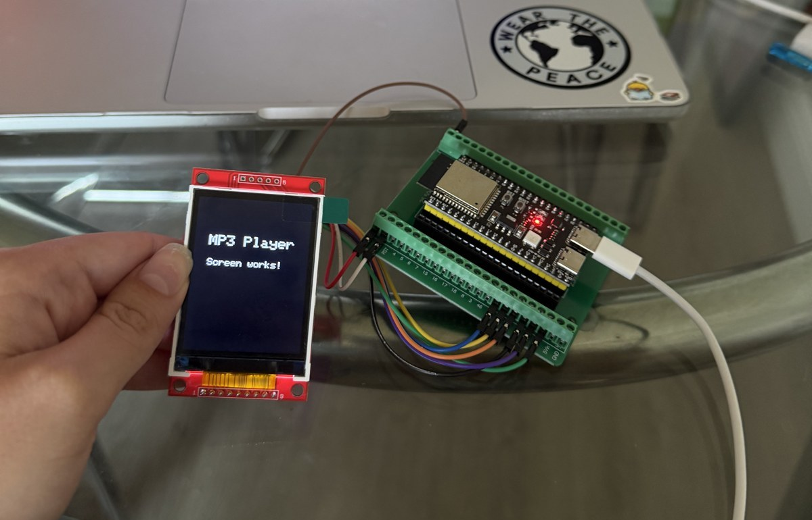

# ESP32-S3 Portable MP3 Player

A handheld MP3 player I'm building on an ESP32-S3. It reads MP3s off a microSD card, decodes them on-chip, and plays them through a MAX98357A I2S amp. There's a 2.2" TFT that will eventually be the UI.

**Work in progress.** Audio playback works and the display works, but they live in separate sketches right now. Getting them into one firmware with an actual UI is what I'm working on next.

## Audio demo

Playback from the SD card through the amp and speaker:

<!-- drag demo.mp4 here -->

## Hardware

| Component | Part |
|---|---|
| MCU | ESP32-S3 Dev Module |
| Display | HiLetgo 2.2" ILI9341 SPI TFT, 240×320 (has a microSD slot on the back) |
| Amp | MAX98357A (I2S DAC + 3W class-D) |
| Storage | microSD card in the display's slot |
| Power | USB for now, LiPo eventually |

## Pinout

The TFT and the SD card share one SPI bus since the SD slot is part of the display module. Each one gets its own chip select.

| Signal | GPIO |
|---|---|
| SPI MOSI (shared) | 11 |
| SPI SCK (shared) | 12 |
| SPI MISO (shared) | 13 |
| TFT CS | 10 |
| TFT DC | 9 |
| TFT RST | 14 |
| SD CS | 18 |
| I2S BCLK | 17 |
| I2S LRC | 15 |
| I2S DOUT | 16 |

## What's in here

- `mp3_player.ino` — the main sketch. Mounts the SD card, sets up I2S, and plays an MP3 using the [ESP32-audioI2S](https://github.com/schreibfaul1/ESP32-audioI2S) library, which handles the actual decoding.
- `i2s_tone_test.ino` — plays a 440 Hz sine wave using the ESP-IDF I2S driver directly. I wrote this to check the amp and speaker wiring before dealing with SD cards and MP3 decoding.
- `display_test.ino` — initializes the ILI9341 and draws some text.

(Arduino IDE wants each sketch in a folder with the same name — it'll offer to move it for you when you open the file.)

## Notes from getting it working

- The display would not talk to the S3 over hardware SPI. Switching to software SPI (passing the MOSI/SCK/MISO pins explicitly to the constructor) fixed it. It's too slow for smooth UI redraws though, so I still need to figure out the hardware SPI issue.
- SD init was flaky until I dropped the clock to 4 MHz.
- Don't run the tone test at full amplitude. Learned that one the loud way — it's at ~25% now.

## Running it

1. Arduino IDE with the ESP32 boards package, board set to **ESP32S3 Dev Module**
2. Libraries: ESP32-audioI2S, Adafruit GFX, Adafruit ILI9341
3. Put an MP3 on the SD card and change the path in `mp3_player.ino` to match (it's `/music/track.mp3` by default)
4. Upload, then open Serial Monitor at 115200 to see what's happening

## Todo

- [x] I2S audio out (sine test)
- [x] Display bring-up
- [x] MP3 playback from SD
- [ ] Combine display + playback into one firmware
- [ ] Song browser on the TFT
- [ ] Buttons for play/pause/skip/volume
- [ ] Fix hardware SPI so screen redraws are fast
- [ ] LiPo battery + charging so it's actually portable
